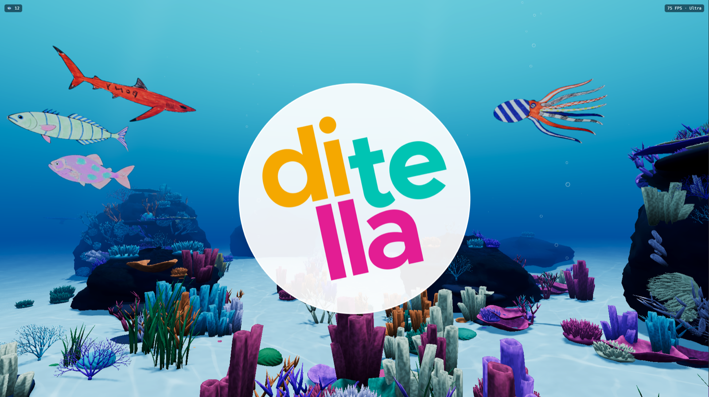
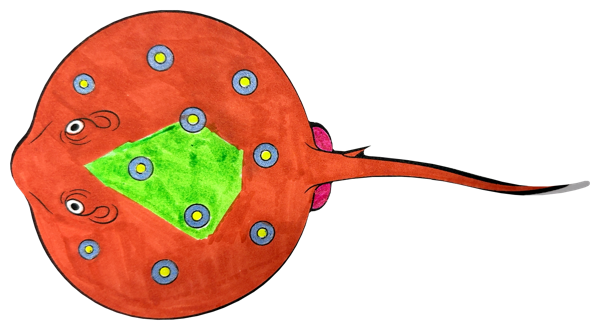

# Acuarella

Acuario colectivo para el Tech Day. Los visitantes pintan plantillas de peces en papel, las escanean con el
teléfono y el dibujo aparece nadando en un arrecife 3D proyectado en pantalla.

Web: https://lia-ditella.github.io/Acuarella/aquarium.html

## Cómo funciona

1. **Escanear.** Una página web abre la cámara del teléfono, reconoce cuál de las siete especies es la hoja,
   corrige posición, giro y perspectiva, y recorta solo el dibujo.
2. **Guardar.** El recorte se sube como PNG con transparencia y queda registrado en la base.
3. **Nadar.** El acuario incorpora cada pez nuevo al instante y rota los que se muestran, así la escena cambia
   a lo largo del día.

Un panel aparte permite revisar lo escaneado y sacar del acuario lo que haga falta. Escanear y administrar
piden contraseña; ver el acuario, no.

## Algunos peces

Dibujos de visitantes, tal como los recortó la aplicación:

<table>
  <tr>
    <td align="center" width="33%"></td>
    <td align="center" width="33%"></td>
    <td align="center" width="33%"></td>
  </tr>
  <tr>
    <td align="center">Pulpo</td>
    <td align="center">Pez piloto</td>
    <td align="center">Raya</td>
  </tr>
</table>

## Tecnologías

- **Three.js (WebGL)** para el arrecife: shaders propios de cáusticas y oleaje, sombras suaves y bloom.
- **JavaScript con ES modules**, sin build ni dependencias en tiempo de ejecución; la librería va versionada
  en el repo para que la instalación no dependa de la red.
- **MediaDevices y Canvas 2D** para la captura, con detección de plantilla escrita a mano: búsqueda del trazo
  impreso, homografía por DLT normalizado y refinamiento iterativo, sin librerías de visión.
- **Supabase** como backend: PostgreSQL con row level security, Storage para los PNG, Auth para el acceso del
  equipo y pg_cron para la rotación de peces.
- **Python y poppler** en las herramientas que convierten las plantillas impresas en contornos.
- **GitHub Pages** para publicar el sitio, que es completamente estático.

```mermaid
flowchart TD

subgraph group_capture["Capture and Recognition"]
  node_scanner_ui["Scanner UI<br/>[app.js]"]
  node_species_scanner["Species Scanner<br/>[autoscan.js]"]
  node_geometry["Geometry Solver<br/>[geometry.js]"]
end

subgraph group_backend["Backend and Operations"]
  node_storage_client["Storage Client<br/>[storage.js]"]
  node_auth_client["Session Auth<br/>[auth.js]"]
  node_access_gate["Access Gate<br/>[gate.js]"]
  node_admin_panel["Admin Panel<br/>[admin.js]"]
  node_database[("Fish Database<br/>[schema.sql]")]
  node_png_storage[("PNG Storage")]
  node_supabase_auth["Supabase Auth"]
  node_rotation["Fish Rotation<br/>[schema.sql]"]
end

subgraph group_aquarium["Aquarium Rendering"]
  node_aquarium_app["Aquarium App<br/>[aquarium.js]"]
  node_reef_renderer["Reef Renderer<br/>[reef.js]"]
  node_creature_system["Creature System<br/>[creatures.js]"]
end

subgraph group_assets["Templates and Assets"]
  node_templates["Template Catalog<br/>[index.json]"]
  node_reef_model["Reef Model<br/>[reef.glb]"]
  node_star_patches["Star Patches<br/>[star-patches.js]"]
end

node_visitor(("Visitor"))
node_operator(("Operator"))
node_public_viewer(("Public Viewer"))
node_camera["Phone Camera"]

node_visitor -->|"starts scan"| node_scanner_ui
node_scanner_ui -->|"captures frames"| node_camera
node_scanner_ui -->|"loads templates"| node_templates
node_scanner_ui -->|"runs detection"| node_species_scanner
node_species_scanner -->|"fits homography"| node_geometry
node_species_scanner -->|"returns result"| node_scanner_ui
node_scanner_ui -->|"saves scan"| node_storage_client
node_storage_client -->|"creates fish"| node_database
node_storage_client -->|"uploads PNG"| node_png_storage
node_operator -->|"opens panel"| node_admin_panel
node_admin_panel -->|"requests key"| node_access_gate
node_access_gate -->|"starts session"| node_auth_client
node_auth_client -->|"gets token"| node_supabase_auth
node_storage_client -->|"refreshes token"| node_auth_client
node_admin_panel -->|"lists or deletes"| node_storage_client
node_public_viewer -->|"opens aquarium"| node_aquarium_app
node_aquarium_app -->|"fetches fish"| node_storage_client
node_storage_client -->|"reads active fish"| node_database
node_database -.->|"runs rotation"| node_rotation
node_rotation -.->|"updates active set"| node_database
node_aquarium_app -->|"creates reef"| node_reef_renderer
node_reef_renderer -->|"loads model"| node_reef_model
node_aquarium_app -->|"syncs fish"| node_creature_system
node_aquarium_app -->|"passes positions"| node_star_patches
node_creature_system -->|"loads PNGs"| node_png_storage

click node_scanner_ui "https://github.com/lia-ditella/acuarella/blob/main/app.js"
click node_species_scanner "https://github.com/lia-ditella/acuarella/blob/main/autoscan.js"
click node_geometry "https://github.com/lia-ditella/acuarella/blob/main/geometry.js"
click node_templates "https://github.com/lia-ditella/acuarella/blob/main/templates/index.json"
click node_storage_client "https://github.com/lia-ditella/acuarella/blob/main/storage.js"
click node_auth_client "https://github.com/lia-ditella/acuarella/blob/main/auth.js"
click node_access_gate "https://github.com/lia-ditella/acuarella/blob/main/gate.js"
click node_admin_panel "https://github.com/lia-ditella/acuarella/blob/main/admin.js"
click node_database "https://github.com/lia-ditella/acuarella/blob/main/supabase/schema.sql"
click node_rotation "https://github.com/lia-ditella/acuarella/blob/main/supabase/schema.sql"
click node_aquarium_app "https://github.com/lia-ditella/acuarella/blob/main/aquarium.js"
click node_reef_renderer "https://github.com/lia-ditella/acuarella/blob/main/reef.js"
click node_creature_system "https://github.com/lia-ditella/acuarella/blob/main/creatures.js"
click node_reef_model "https://github.com/lia-ditella/acuarella/blob/main/reef/reef.glb"
click node_star_patches "https://github.com/lia-ditella/acuarella/blob/main/reef/star-patches.js"

classDef toneNeutral fill:#f8fafc,stroke:#334155,stroke-width:1.5px,color:#0f172a
classDef toneBlue fill:#dbeafe,stroke:#2563eb,stroke-width:1.5px,color:#172554
classDef toneAmber fill:#fef3c7,stroke:#d97706,stroke-width:1.5px,color:#78350f
classDef toneMint fill:#dcfce7,stroke:#16a34a,stroke-width:1.5px,color:#14532d
classDef toneRose fill:#ffe4e6,stroke:#e11d48,stroke-width:1.5px,color:#881337
classDef toneIndigo fill:#e0e7ff,stroke:#4f46e5,stroke-width:1.5px,color:#312e81
classDef toneTeal fill:#ccfbf1,stroke:#0f766e,stroke-width:1.5px,color:#134e4a
class node_scanner_ui,node_species_scanner,node_geometry,node_public_viewer toneBlue
class node_storage_client,node_auth_client,node_access_gate,node_admin_panel,node_database,node_png_storage,node_supabase_auth,node_rotation toneAmber
class node_aquarium_app,node_reef_renderer,node_creature_system toneMint
class node_templates,node_reef_model,node_star_patches toneRose
class node_visitor,node_operator,node_camera toneIndigo
```

